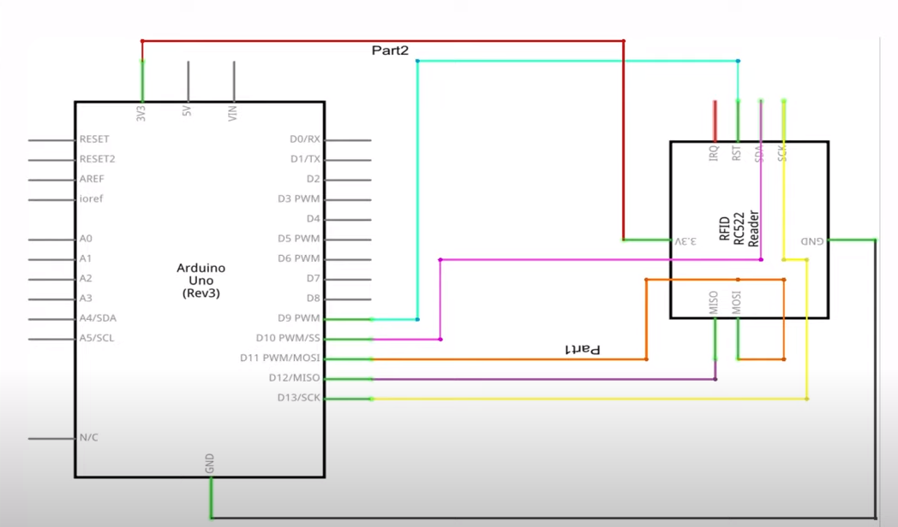

# Arduino Attendance with RFID

This is a project for NM State Esports whereby students can scan a card and their attendance in the lab will be logged. 

Based on youtube video: https://www.youtube.com/watch?v=MA3hWp2efZ8

Schematic: 